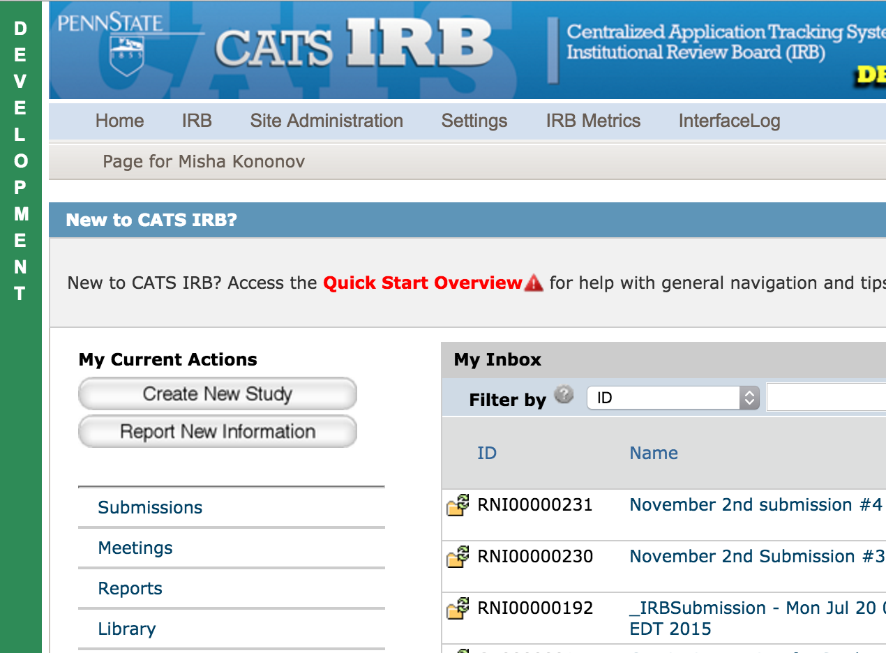

# IRB Server Markers

This small userscript enables styling on CATS IRB sites to easily display the
environment that you are working in. A colored bar displays the environment name,
and red warning icons mark links to external resources.

